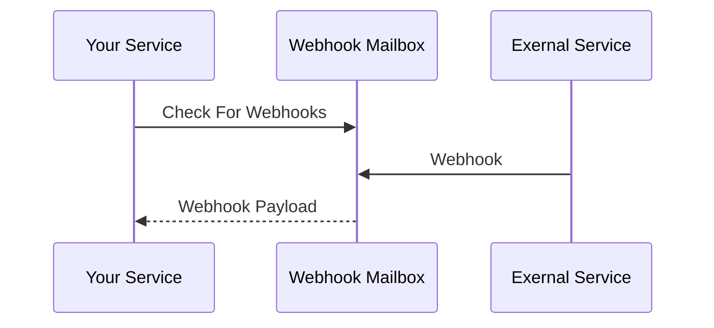

A super simple service that accepts webhooks for you.



No need to set up an account. Your service can just allocate a mailbox at will.

Client example:

```python
mailbox = generate_32_random_bytes()
address = sha256_hash(mailbox)

requests.post(
    'https://external-service.example.com/',
    data={'webhook_url': 'https://webhook-mailbox.com/hook/' + hex(address)},
)

message = requests.get(
    'https://webhook-mailbox.com/watch/',
    headers={"Authorization": "Bearer " + hex(mailbox)},
)
```
## Current State

pre-alpha. It runs, in theory it should work, but the service doesn't to much to protect against
abuse from WAN. Messages aren't stored persistently. There's no way to perform updates while
maintaining high availability. etc...

## License

Licensed under either of

 * Apache License, Version 2.0
   ([LICENSE-APACHE](LICENSE-APACHE) or http://www.apache.org/licenses/LICENSE-2.0)
 * MIT license
   ([LICENSE-MIT](LICENSE-MIT) or http://opensource.org/licenses/MIT)

at your option.

## Contribution

Unless you explicitly state otherwise, any contribution intentionally submitted
for inclusion in the work by you, as defined in the Apache-2.0 license, shall be
dual licensed as above, without any additional terms or conditions.
