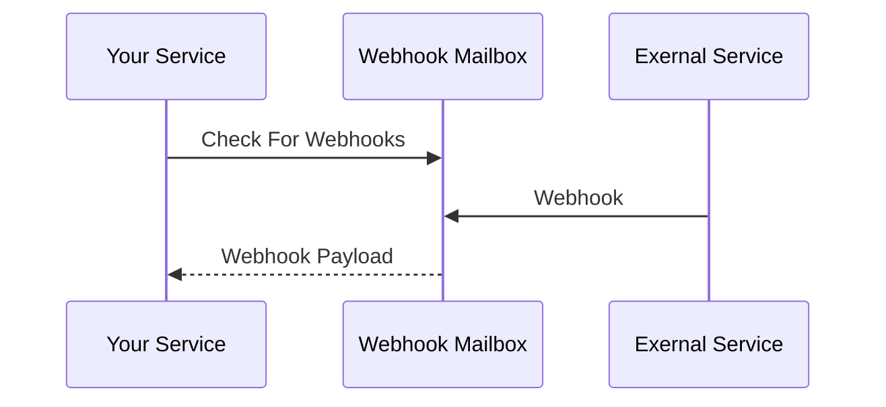

A super simple service that accepts webhooks for you.



No need to set up an account. Your service can just allocate a mailbox at will.

Client example:

```python
#!/usr/bin/env python3

import secrets
import hashlib
import requests

mailbox = secrets.token_bytes(32)
address = hashlib.sha256(mailbox).digest()

requests.post(
    "https://external-service.example.com/",
    json={"webhook_url": "https://webhook-mailbox.com/api/hook/" + address.hex()},
)

message = requests.get(
    "https://webhook-mailbox.com/api/watch/",
    headers={"Authorization": "Bearer " + mailbox.hex()},
)
```

## Current State

pre-alpha. It works (for some definition of "works"), but the service doesn't to much to
protect against abuse from WAN. Messages aren't stored persistently. When memory fills
oom will cause pending messages to be lost. There's no way to perform updates while
maintaining high availability. The api isn't stable. It makes weird banging noises when
accelerating. etc...

That said, this app is live at `https://webhook-mailbox.com/api`. You can try it out now!

## License

Licensed under either of

 * Apache License, Version 2.0
   ([LICENSE-APACHE](LICENSE-APACHE) or http://www.apache.org/licenses/LICENSE-2.0)
 * MIT license
   ([LICENSE-MIT](LICENSE-MIT) or http://opensource.org/licenses/MIT)

at your option.

## Contribution

Unless you explicitly state otherwise, any contribution intentionally submitted
for inclusion in the work by you, as defined in the Apache-2.0 license, shall be
dual licensed as above, without any additional terms or conditions.
